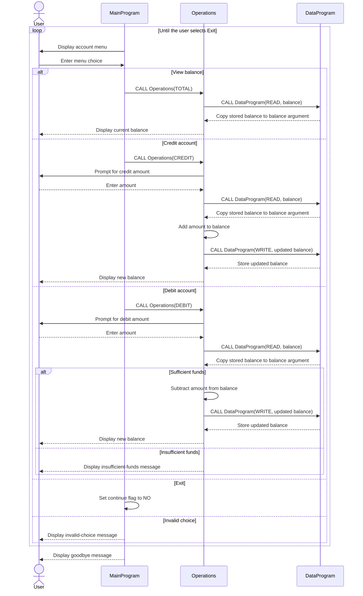

# COBOL Account Management

This directory documents the COBOL account management example in `src/cobol/`.
The current implementation manages one in-memory balance; it does not store
student records, identify account holders, or support multiple accounts.

## Source Files

### `main.cob` - `MainProgram`

The program entry point displays the account menu, reads the user's selection,
and dispatches account operations to `Operations`.

Key behavior:

- Option 1 requests and displays the current balance.
- Option 2 requests a credit amount.
- Option 3 requests a debit amount.
- Option 4 exits the menu loop.
- Other selections display an invalid-choice message.

### `operations.cob` - `Operations`

Processes the requested account operation and interacts with `DataProgram` to
read or update the balance.

Key behavior:

- `TOTAL` reads and displays the current balance.
- `CREDIT` accepts an amount, adds it to the balance, and writes the result.
- `DEBIT` accepts an amount and subtracts it only when the balance is
  sufficient; otherwise, it displays an insufficient-funds message.

### `data.cob` - `DataProgram`

Provides the balance storage interface used by `Operations`. A `READ` request
copies the stored balance to the caller, and a `WRITE` request replaces the
stored balance. The balance is held in COBOL working storage, not in a file or
database.

## Account Rules and Limits

- The single balance is initialized to `1000.00` when the program starts.
- A debit is rejected when its requested amount exceeds the available balance;
  rejected debits do not update the stored balance.
- Credits are added directly. The program does not explicitly reject zero or
  negative credit amounts.
- The amount and balance fields use `PIC 9(6)V99`: six integer digits and two
  implied decimal digits. The source does not include explicit validation for
  out-of-range input or arithmetic overflow.
- There is no student ID, student profile, per-student balance, transaction
  history, or persistent storage in the current implementation. These would
  need to be added before the program could enforce student-specific account
  rules.

## Application Data Flow

